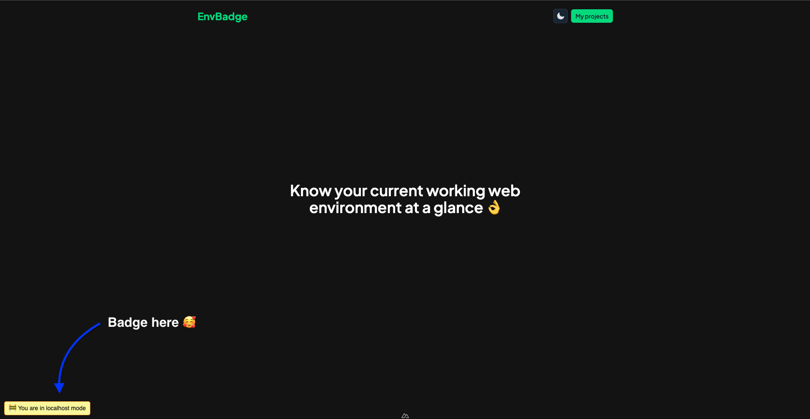

# 🚧 EnvBadge

EnvBadge keeps you informed about your current environment at a glance.

## Take a peek

## Setup

1. visit https://envbadge.vercel.app and sign in using your github account
2. Create a project. A project is simply the app you are working on. A projectID will be generated for each project
3. Create environment(s) for a project by specifying the name and url.
   - The name of the environment can be anything to help you identify which is whuch, for example; local, development, staging, QA environment etc.
   - URL is simply the url hosting the environment for example localhost:3000, 127.0.0.1:5500, dev.website.com, staging.website.com
4. Go to the project's setup tab and copy the code snippet. This should be placed right before the closing `</body>` of your website or app. And you are done.
5. You can toggle the visibility if the badge for any environment, if you want to

## Related package

[envbadge-js](https://github.com/ize-302/envbadge-js)
